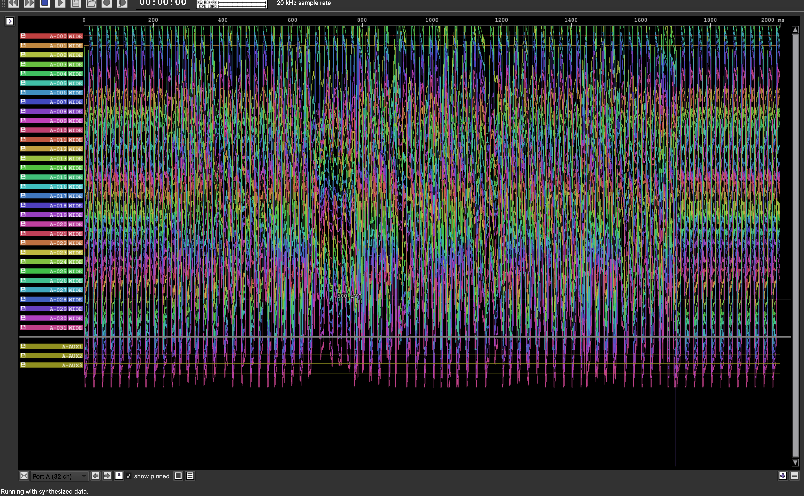
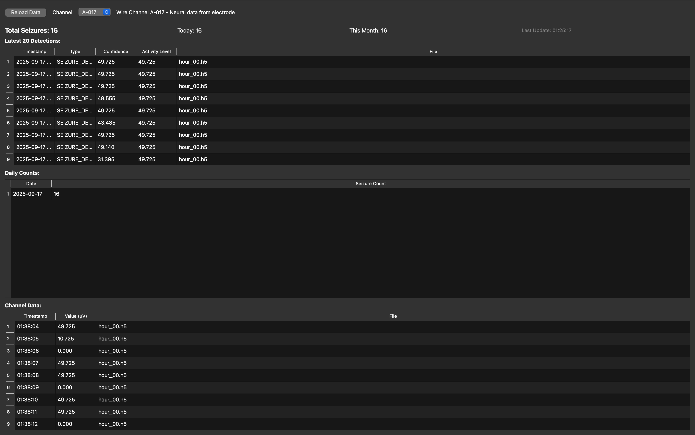

# HALO Testing Pipeline

Testing pipeline for HALO neural data acquisition and FPGA processing.

## Demo Screenshots

### Real-time Neural Data Visualization

*Modified Intan RHX visualization interface showing real-time neural data acquisition*

### Seizure Detection Logging

*Real-time seizure detection analysis with decoded FPGA responses showing normal activity, threshold exceeded events, and seizure detections*

## How to Run

Make sure that both of the devices are connected. The modified Intan visualization SDK will be opened automatically.

```bash
make run
```

## Documentation

- API documentation: https://intantech.com/files/Intan_RHD2000_USB3_FPGA_interface.pdf
- Intan downloads page: https://intantech.com/downloads.html

> [!NOTE] 
> If the pipeline cannot establish a connection to the device, try power-cycling (restarting) the device.

## TODO

- ~~Decode ASIC response~~
- Ensure the device is properly flushed and closed to prevent resource leaks or communication errors
- Include additional data analysis required for the animal testing
